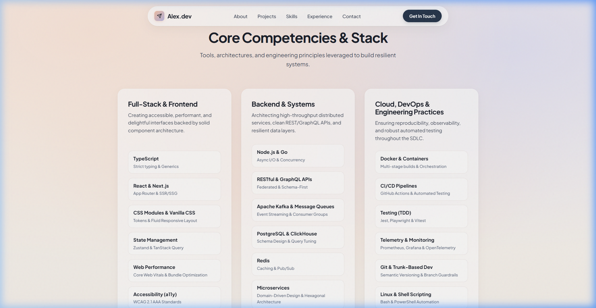

<div align="center">

# 🌅 Portfolio Website

**An ultra-premium, type-safe developer portfolio & case study engine built with Next.js (App Router), TypeScript, and CSS Modules.**

[](https://nextjs.org/)
[](https://www.typescriptlang.org/)
[](https://github.com/css-modules/css-modules)
[](https://nextjs.org/docs/app/building-your-application/deploying/static-exports)
[](#-architectural-decisions--governance)
[](LICENSE)

<br />

[Features](#-key-features) • [Interface Preview](#-interface-preview-feature-breakdown) • [Architecture](#-project-architecture) • [Getting Started](#-getting-started) • [Content Guide](#-content-customization-guide) • [ADRs](#-architectural-decisions--governance)

</div>

---

## 📖 Overview

The **Dawn Pastel Editorial Portfolio** is an all-round developer portfolio designed with an editorial aesthetic inspired by morning skies, refined magazine typography, and warm tactile surfaces. Engineered from inception under strict **Software Development Life Cycle (SDLC)** governance, **Matt Pocock Engineering Standards**, and **ADR-documented decisions**, it offers blazing performance, strict type safety, zero bloat, and an unforgettable user experience.

### ✨ Core Highlights

- **Dawn Pastel Editorial Aesthetics**: A curated color palette blending dawn sky blues, sunrise apricots, and soft rose quartz accents with tactile glassmorphism.
- **Bento Grid Showcase**: A responsive, asymmetrical grid hierarchy prioritizing flagship projects with tags, metrics, and live indicators.
- **Dynamic Case Study Routes (`/projects/[slug]`)**: Dedicated deep-dive architectural breakdowns with problem statements, solutions, system metrics, and technical diagrams.
- **1-Click Interactive Contact Pill**: Instant clipboard copy with animated haptic feedback and toast notification state.
- **Zero-Runtime Overhead**: Native CSS Modules with CSS custom properties (variables)—no utility framework bloat, 100% style isolation.
- **Decoupled Data Layer**: Clean separation of content from UI logic via strongly-typed TypeScript models in `src/data/`.

---

## 📸 Interface Preview (Feature Breakdown)

Each section of the application has been purposefully architected and polished for both desktop and mobile viewports.

### 1. Hero Section & Origami Paper Plane Centerpiece
> Features an SVG stippled flight trail, dynamic status badge, and call-to-action buttons styled in frosted glassmorphism.


- **Status Indicator**: Pulse dot showcasing immediate work availability.
- **Vector Artwork**: Crisp SVG geometric paper plane with dashed wind trails.
- **Tactile CTAs**: Gradient primary action paired with frosted secondary link with micro-hover physics.

---

### 2. Editorial About & Engineering Philosophy
> A warm, magazine-style introduction outlining core technical principles and problem-solving mindset.


- **Subtle Glass Card**: High-contrast slate typography on frosted translucent backdrop (`backdrop-filter: blur(12px)`).
- **Core Philosophies**: Structured highlights emphasizing production resilience, developer ergonomics, and system craft.

---

### 3. Bento Grid Project Showcase
> Asymmetrical, visually balanced grid highlighting flagship applications with live demo tags and direct routes.


- **Visual Hierarchy**: Large 2-column feature card for flagship project, complemented by balanced secondary cards.
- **Metadata Chips**: Color-coded category tags (`Fullstack AI`, `Open Source`, `Mobile IoT`) and tech stack pills.
- **Smooth Navigation**: Hover zoom states and direct links to dedicated route pages.

---

### 4. Case Study Deep-Dive Route (`/projects/[slug]`)
> In-depth system case studies providing recruiters and engineering leads with architectural proof points.

#### Top Hero & Impact Metrics


#### Architecture Diagram & Technical Decisions


- **Impact Metric Pills**: Quantified results (e.g., *"< 120ms Latency"*, *"100k+ Events/sec"*).
- **Architecture Callout Block**: Visual system flow diagrams and technical stack breakdowns.
- **Return Navigation**: Seamless back-button preserving scroll state and user orientation.

---

### 5. Skills & Technical Proficiencies
> Multi-category breakdown grouping modern frontend, distributed backend, and DevOps tooling.



- **Categorized Badges**: Distinct groupings for Frontend, Backend, Cloud & DevOps, and Architecture.
- **Proficiency Highlights**: Clean, readable tag clouds that avoid unquantifiable percentage bars in favor of proven tech stacks.

---

### 6. Experience & Career Trajectory
> Chronological journey tracking engineering impact, milestones, and organizational leadership.


- **Timeline Stem**: Connected stippled line anchoring career milestones.
- **Impact Bullet Points**: Action-oriented descriptions detailing team leadership, architectural refactors, and performance gains.

---

### 7. Interactive Contact Pill & Instant Feedback
> One-click email clipboard copy with visual feedback toast and quick social links.


- **One-Click Clipboard**: Instant `navigator.clipboard.writeText` execution.
- **Active State Toast**: Seamless transition from default button state to *"Copied to clipboard!"* toast notification.
- **Direct Reach-Out Channels**: Direct links to GitHub, LinkedIn, and Twitter/X.

---

## 📂 Project Architecture

```
Portfolio-Website/
├── .agents/skills/              # Matt Pocock AI & engineering practice skills
│   ├── code-review/
│   ├── codebase-design/
│   ├── domain-modeling/
│   └── tdd/
├── docs/
│   ├── adr/                     # Architectural Decision Records (ADRs)
│   │   ├── 0001-nextjs-app-router-typescript.md
│   │   └── 0002-css-modules-design-tokens.md
│   └── assets/preview/          # High-resolution interface preview documentation
├── public/
│   ├── preview/                 # Static previews for web distribution
│   └── favicon.ico
├── src/
│   ├── app/
│   │   ├── globals.css          # Design tokens (Dawn Pastel palette & stipples)
│   │   ├── layout.tsx           # Semantic root HTML5, metadata & Outfit font
│   │   ├── page.tsx             # Main landing page assembling sections
│   │   └── projects/
│   │       └── [slug]/
│   │           └── page.tsx     # Dynamic case study route with generateStaticParams
│   ├── components/              # Modular UI components with scoped CSS
│   │   ├── Navbar.tsx           # Floating glass pill navigation bar
│   │   ├── Hero.tsx             # Origami centerpiece & headline
│   │   ├── About.tsx            # Editorial biography & values
│   │   ├── Projects.tsx         # Bento Grid showcase
│   │   ├── Skills.tsx           # Technical taxonomy cards
│   │   ├── Experience.tsx       # Chronological career timeline
│   │   └── Contact.tsx          # 1-click clipboard contact card
│   └── data/                    # Decoupled TypeScript Single-Source-of-Truth
│       ├── types.ts             # Domain models (Project, SkillCategory, Experience)
│       ├── profile.ts           # Author bio, contact details, social links
│       ├── projects.ts          # Complete case studies & project metadata
│       ├── skills.ts            # Technical skills grouped by domain
│       └── experience.ts        # Work history & career achievements
├── CONTEXT.md                   # Bounded domain vocabulary & glossary
├── next.config.mjs              # Next.js production configuration
├── tsconfig.json                # Strict TypeScript configuration
├── package.json                 # Dependency manifests
└── README.md                    # Repository documentation
```

---

## 🛠️ Tech Stack & Decisions

| Layer | Technology | Rationale |
| :--- | :--- | :--- |
| **Framework** | [Next.js 14 App Router](https://nextjs.org/) | Modern React Server Components (RSC), built-in static optimization, and standard nested routing. |
| **Language** | [TypeScript 5](https://www.typescriptlang.org/) | Strict type checking across data models, props, and routing parameters. |
| **Styling** | Vanilla CSS Modules | Zero-runtime CSS, complete style encapsulation, zero build-time utility generation overhead. |
| **Typography** | [Outfit](https://fonts.google.com/specimen/Outfit) via `next/font` | Clean geometric sans-serif loaded with zero layout shift (zero CLS). |
| **Data Flow** | Static Data Modules (`src/data/*`) | Total decoupling of content from markup; editable without touching JSX or CSS. |

---

## 🚀 Getting Started

### Prerequisites
- **Node.js**: v18.17.0 or higher
- **npm**: v9.0.0 or higher (or pnpm / yarn)

### 1. Clone the Repository
```bash
git clone https://github.com/your-username/portfolio-website.git
cd portfolio-website
```

### 2. Install Dependencies
```bash
npm install
```

### 3. Start Development Server
```bash
npm run dev
```
Navigate to [http://localhost:3000](http://localhost:3000) to view the live site with Hot Module Replacement (HMR).

### 4. Build for Production
```bash
npm run build
npm run start
```
The optimized static build will be generated in `.next/` and ready for high-performance deployment.

---

## ✏️ Content Customization Guide

All portfolio content is intentionally decoupled into clean, typed data modules in `src/data/`:

### Personal Profile & Socials
Edit [`src/data/profile.ts`](file:///f:/ComSci/Coding/Project/Portfolio-Website/src/data/profile.ts):
```typescript
export const profileData = {
  name: "Your Name",
  role: "Senior Full-Stack Engineer",
  tagline: "Crafting resilient web architectures...",
  status: "Available for Q3/Q4 contracts",
  email: "your.email@domain.com",
  socials: {
    github: "https://github.com/your-username",
    linkedin: "https://linkedin.com/in/your-username",
    twitter: "https://twitter.com/your-username",
  },
};
```

### Projects & In-Depth Case Studies
Edit [`src/data/projects.ts`](file:///f:/ComSci/Coding/Project/Portfolio-Website/src/data/projects.ts):
```typescript
export const projectsData: Project[] = [
  {
    slug: "project-slug",
    title: "Project Title",
    tagline: "One-line executive summary",
    category: "Fullstack AI",
    bentoSpan: "col-span-2", // "col-span-2" for flagship, "col-span-1" for regular
    featured: true,
    liveUrl: "https://...",
    githubUrl: "https://github.com/...",
    caseStudy: {
      overview: "...",
      challenge: "...",
      solution: "...",
      architecture: "...",
      metrics: ["< 50ms P99", "10k DAU"],
    },
  },
];
```

### Technical Skills
Edit [`src/data/skills.ts`](file:///f:/ComSci/Coding/Project/Portfolio-Website/src/data/skills.ts) to add or organize skill categories and badges.

### Experience Timeline
Edit [`src/data/experience.ts`](file:///f:/ComSci/Coding/Project/Portfolio-Website/src/data/experience.ts) to update roles, dates, company names, and achievements.

---

## 🏛️ Architectural Decisions & Governance

This project adheres to formal **Architecture Decision Records (ADRs)** located in `docs/adr/`:

- [ADR-0001: Next.js App Router with TypeScript](docs/adr/0001-nextjs-app-router-typescript.md) — Rationale for selecting Next.js App Router and static export capabilities.
- [ADR-0002: Vanilla CSS Modules with Design Tokens](docs/adr/0002-css-modules-design-tokens.md) — Strategy for robust styling without external runtime dependencies.
- [CONTEXT.md](CONTEXT.md) — Comprehensive domain dictionary and ubiquitous language definition.

---

## ⚡ Quality & Performance Standards

- **Core Web Vitals**: Zero Cumulative Layout Shift (CLS), sub-second Largest Contentful Paint (LCP).
- **Accessibility (a11y)**: WCAG 2.1 AA compliant color contrast ratios across all text elements.
- **SEO & Social Cards**: Semantic HTML5 hierarchy (`<header>`, `<nav>`, `<main>`, `<section>`, `<footer>`), OpenGraph and Twitter card meta-tags ready.
- **Responsive Fluid Layouts**: Fully tested across mobile (375px), tablet (768px), and high-resolution desktop (1440px+).

---

## 📄 License

Distributed under the **MIT License**. See `LICENSE` for more information.

---

<div align="center">
  <sub>Crafted with passion, precision, and dawn sky serenity.</sub>
</div>