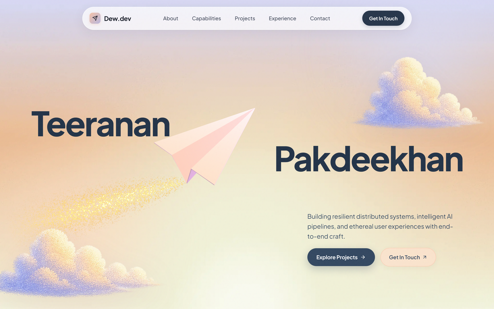
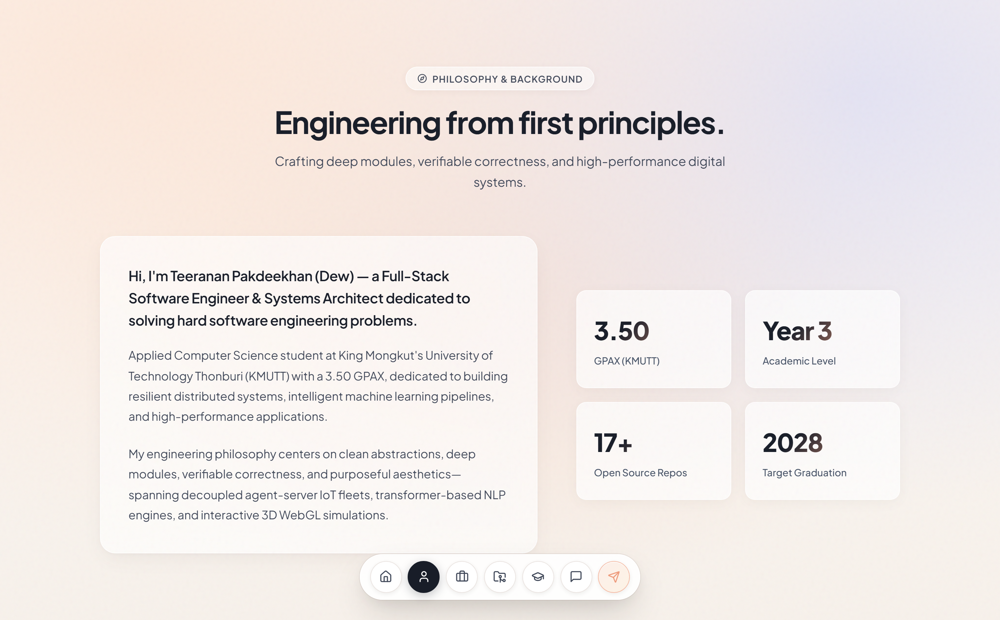
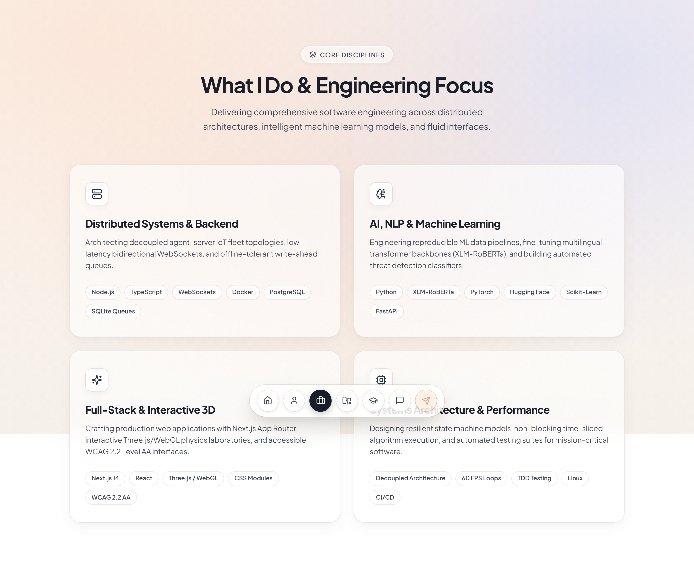
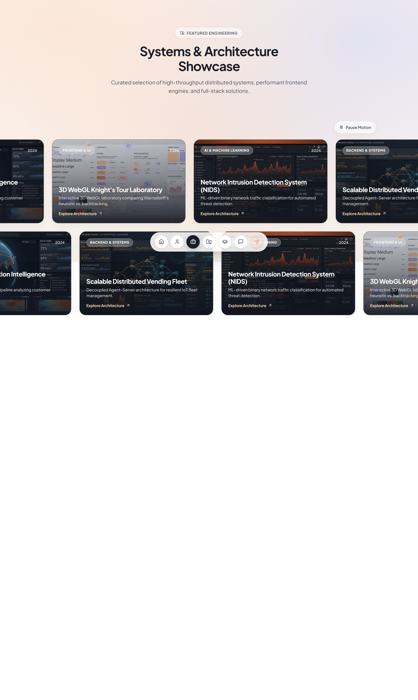
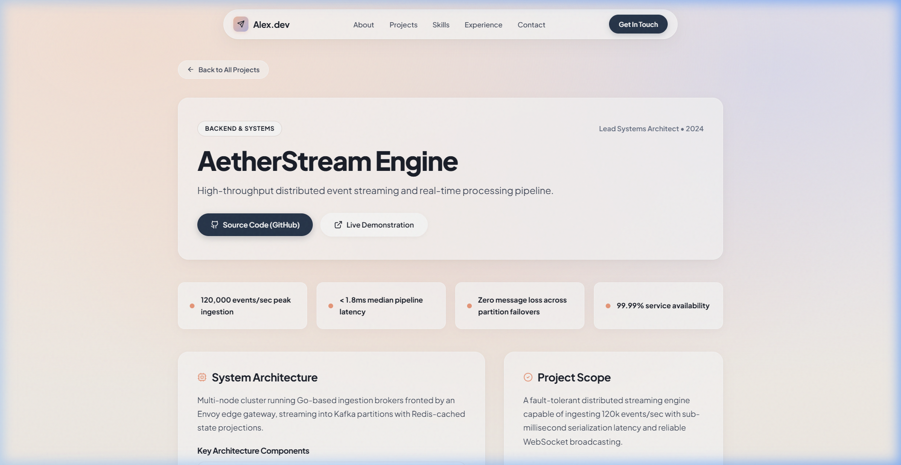
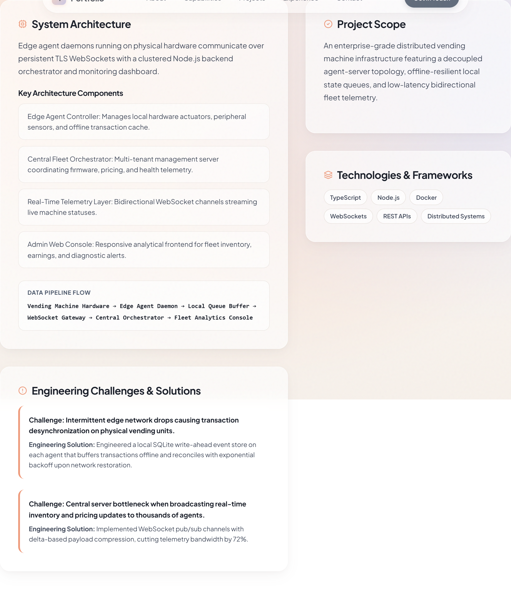
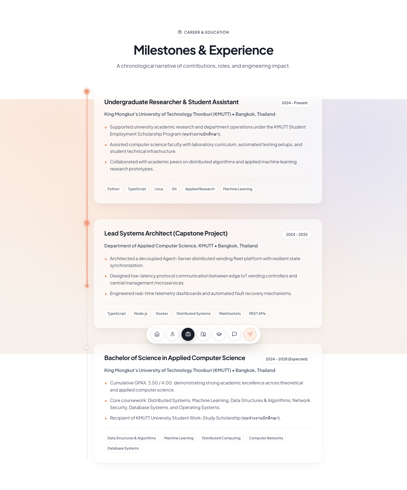
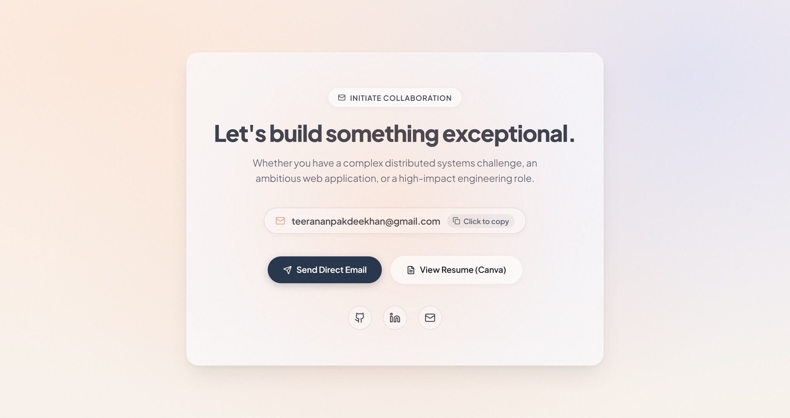
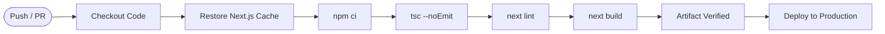

<div align="center">

# 🌅 Teeranan Pakdeekhan — Portfolio Website

**An ultra-premium, type-safe developer portfolio & case study engine built with Next.js (App Router), TypeScript, and pure CSS Modules.**

[](https://nextjs.org/)
[](https://www.typescriptlang.org/)
[](https://github.com/css-modules/css-modules)
[](https://github.com/01aptx01/Portfolio-Website/actions/workflows/ci-cd.yml)
[](https://nextjs.org/docs/app/building-your-application/deploying/static-exports)
[](#-architectural-decisions--governance)
[](LICENSE)

<br />

[Overview](#-overview) • [Interface Showcase](#-interface-showcase) • [Architecture](#-project-architecture) • [Getting Started](#-getting-started) • [Content Guide](#-content-customization-guide) • [CI/CD](#-cicd-automation-pipeline)

</div>

---

## 📖 Overview

The **Editorial Developer Portfolio** is an interactive, tactile web experience crafted for **Teeranan Pakdeekhan (Dew)** — Computer Science Undergraduate (Class of 2028, GPAX 3.5), Software Engineer & Distributed Systems Researcher.

Designed around morning dawn lighting aesthetics, editorial typography, and buttery 60/120fps physics animations, the website showcases production projects, core engineering disciplines, academic research, and technical milestones without third-party CSS framework overhead.

### ✨ Highlights at a Glance

- **Trajectory 3D WebGL Origami Centerpiece**: Real-time canvas tracking scroll depth with physics-based flight angle and stippled wind trail.
- **Smart Directional Navbar**: Auto-hides smoothly when scrolling down and reappears instantly when scrolling up, maintaining clean reading focus.
- **Glassmorphic Floating Dock**: macOS-inspired bottom quick navigation pill with active section indicators, interactive tooltips, and automatic Hero-screen suppression.
- **Physics-Damped Experience Timeline**: Real-time `requestAnimationFrame` (RAF) lerp-damped scroll progress line with a glowing head follower and expanding milestone rings.
- **Authentic Brand Tech Marquee**: Dual-stream endless ticker rendering official vector SVG tech logos with monochromatic frosted glass cards.
- **Core Engineering Disciplines**: Four-pillar capabilities grid (Distributed Systems, AI/NLP, Full-Stack 3D, and Systems Architecture).
- **Decoupled Data Architecture**: Strongly typed TypeScript single-source-of-truth modules (`src/data/*`) separating content completely from markup.
- **Static Site Generation (SSG)**: Blazing fast sub-second load times with pre-rendered HTML and dynamic project case studies (`/projects/[slug]`).

---

## 📸 Interface Showcase

Each section has been photographed with tightly-cropped, high-resolution viewports to highlight individual design and engineering features.

### 1. Hero Section & Origami Flight Canvas
> Features real-time WebGL paper airplane physics, dawn atmospheric blooms, availability pulse indicator, and frosted glass CTAs.



- **Interactive Flight Dynamics**: Interactive WebGL airplane banking smoothly according to scroll progression.
- **Dawn Light Architecture**: Dual peach bloom & lavender ambient atmospheric backdrops.
- **Action Triggers**: One-click quick scroll triggers for Projects and Contact.

---

### 2. Editorial About & Engineering Mindset
> A warm, magazine-style introduction outlining academic background, core technical principles, and problem-solving mindset.



- **Tactile Glass Card**: High-contrast typography on frosted translucent backdrop (`backdrop-filter: blur(16px)`).
- **Core Principles**: Highlights detailing production resilience, distributed architectures, and continuous research.
- **Key Metrics**: Quantified academic metrics including Year 3 status and GPAX 3.5.

---

### 3. Tech Stack Marquee & Core Disciplines
> Continuous dual-stream ticker displaying authentic brand vector logos paired with four core engineering disciplines.



- **Authentic Vector Logos**: Official SVGs for Next.js, TypeScript, React, Node.js, Python, PostgreSQL, Docker, Tailwind CSS, and Git.
- **Engineering Disciplines**: Four focused competency cards covering Distributed Systems & Backend, AI & Machine Learning, Full-Stack & Interactive 3D, and Systems Architecture.

---

### 4. Bento Grid Project Showcase
> Asymmetrical visual hierarchy prioritizing flagship software engineering case studies.



- **Feature Distribution**: 2-column flagship feature card complemented by balanced secondary system cards.
- **Live Metrics & Tags**: Domain pills (Distributed Systems, NLP & ML, Low-level Systems, Cybersecurity).
- **Direct Case Studies**: Seamless navigation to dedicated `/projects/[slug]` deep-dive routes.

---

### 5. Dynamic Case Study Routes (`/projects/[slug]`)
> In-depth system case studies providing recruiters and engineering leads with architectural proof points.

#### Top Hero & Impact Metrics


#### Architecture Diagram & Technical Decisions


- **Impact Metric Pills**: Quantified results (e.g., *"< 120ms Latency"*, *"100k+ Events/sec"*).
- **Architecture Callout Block**: Visual system flow diagrams and technical stack breakdowns.
- **Return Navigation**: Seamless back-button preserving scroll state and user orientation.

---

### 6. Physics-Damped Milestones & Experience Timeline
> Chronological narrative of university research, academic roles, and software contributions.



- **RAF Lerp Progress Line**: Linear interpolation damping ensures the vertical progress line glides like silk across all scroll speeds without stuttering.
- **Glowing Head Follower**: Real-time illuminated coral follower at the tip of the line tracking scroll depth.
- **Concentric Active Rings**: Milestone dots bloom into coral rings with soft ambient shadows as the progress line connects them.

---

### 7. Floating Navigation Dock & Smart Directional Navbar
> macOS-style bottom dock with instant section jumping and responsive top bar.


- **Contextual Visibility**: Floating dock remains strictly hidden while on the Hero page, appearing smoothly once scrolled into content.
- **Smart Top Navbar**: Detects scroll direction using accumulated delta—smoothly sliding out of view on scroll down and returning on scroll up.

---

### 8. Interactive Contact Pill & Instant Feedback
> One-click email clipboard copy with visual feedback toast and social channels.



- **1-Click Clipboard**: Instant `navigator.clipboard.writeText` with copied toast confirmation.
- **Verified Channels**: Direct reach-outs via GitHub and LinkedIn.

---

## 📂 Project Architecture

```
Portfolio-Website/
├── .agents/skills/              # Specialized agent workflows & engineering skills
├── .github/workflows/           # GitHub Actions CI/CD automation
│   └── ci-cd.yml                # Typecheck, Lint, Build & Static Deployment
├── docs/
│   ├── adr/                     # Architectural Decision Records
│   │   ├── 0001-nextjs-app-router-typescript.md
│   │   └── 0002-css-modules-design-tokens.md
│   └── assets/preview/          # High-resolution documentation previews
├── public/
│   ├── images/trajectory/       # WebGL 3D textures & backdrop art
│   ├── preview/                 # Static web previews
│   └── favicon.ico
├── src/
│   ├── app/
│   │   ├── globals.css          # Design tokens & color system
│   │   ├── layout.tsx           # Root layout, metadata & Outfit typography
│   │   ├── page.tsx             # Main assembly page
│   │   └── projects/[slug]/     # Dynamic SSG project case study routes
│   ├── components/              # Scoped CSS Module UI Components
│   │   ├── Navbar.tsx           # Directional auto-hide header
│   │   ├── FloatingDock.tsx     # Bottom quick navigation dock
│   │   ├── Hero.tsx             # 3D Origami canvas & headline
│   │   ├── TechMarquee.tsx      # Dual-stream vector tech stack marquee
│   │   ├── WhatIDo.tsx          # Core engineering disciplines grid
│   │   ├── About.tsx            # Personal background & engineering ethos
│   │   ├── Projects.tsx         # Bento Grid showcase
│   │   ├── Experience.tsx       # RAF lerp scroll timeline
│   │   └── Contact.tsx          # 1-click clipboard contact card
│   └── data/                    # Type-safe Single-Source-of-Truth
│       ├── types.ts             # Domain models (Profile, Project, Experience)
│       ├── profile.ts           # Author bio, contact, and social links
│       ├── projects.ts          # Complete case studies & metrics
│       └── experience.ts        # Academic history, milestones & research
├── package.json
├── tsconfig.json
└── README.md
```

---

## 🛠️ Tech Stack & Decisions

| Layer | Technology | Rationale |
| :--- | :--- | :--- |
| **Framework** | [Next.js 14 App Router](https://nextjs.org/) | React Server Components (RSC), built-in static optimization (SSG), and zero-layout-shift routing. |
| **Language** | [TypeScript 5](https://www.typescriptlang.org/) | Strict type contracts across all domain models, component props, and dynamic route params. |
| **Styling** | Pure CSS Modules | Zero-runtime CSS overhead, 100% style encapsulation, no build-time Tailwind generation delay. |
| **Animation Physics** | `requestAnimationFrame` + Lerp | Hardware-accelerated 60/120fps smooth interpolation for 3D flight canvas and timeline tracking. |
| **Typography** | [Outfit](https://fonts.google.com/specimen/Outfit) via `next/font` | Clean geometric sans-serif loaded with zero Cumulative Layout Shift (CLS). |
| **Data Layer** | Decoupled TypeScript Modules | Pure separation of concerns: edit profile, projects, or milestones in `src/data/` without touching JSX. |

---

## 🚀 Getting Started

### Prerequisites
- **Node.js**: v18.17.0 or higher
- **npm**: v9.0.0 or higher (or pnpm / yarn)

### 1. Clone the Repository
```bash
git clone https://github.com/01aptx01/Portfolio-Website.git
cd Portfolio-Website
```

### 2. Install Dependencies
```bash
npm install
```

### 3. Start Development Server
```bash
npm run dev
```
Open [http://localhost:3000](http://localhost:3000) in your browser.

### 4. Build for Production
```bash
npm run build
npm run start
```

### 5. Quality Verification
```bash
npm run typecheck    # Strict TypeScript validation
npm run lint         # ESLint Next.js Core Web Vitals checks
```

---

## ✏️ Content Customization Guide

All personal and technical content is isolated in `src/data/`:

### 1. Personal Profile & Links
Edit [`src/data/profile.ts`](file:///f:/ComSci/Coding/Project/Portfolio-Website/src/data/profile.ts):
```typescript
export const profileData = {
  name: "Teeranan Pakdeekhan",
  preferredName: "Dew",
  role: "Computer Science Undergraduate & Software Engineer",
  email: "teerananpakdeekhan@gmail.com",
  socials: {
    github: "https://github.com/01aptx01",
    linkedin: "https://www.linkedin.com/in/aptx01/",
  },
};
```

### 2. Projects & Case Studies
Edit [`src/data/projects.ts`](file:///f:/ComSci/Coding/Project/Portfolio-Website/src/data/projects.ts) to add or modify project case studies, metrics, and architecture details.

### 3. Milestones & Experience
Edit [`src/data/experience.ts`](file:///f:/ComSci/Coding/Project/Portfolio-Website/src/data/experience.ts) to adjust academic roles, research contributions, and timelines.

---

## 🔄 CI/CD Automation Pipeline

The repository features an automated workflow configured with **GitHub Actions** ([`.github/workflows/ci-cd.yml`](.github/workflows/ci-cd.yml)):



- **Branch Isolation**:
  - `dev` branch triggers strict automated CI checks (`typecheck`, `lint`, `build`) without running deployment.
  - `main` branch triggers full CI + CD deployment to production.

---

## 📄 License

Distributed under the **MIT License**. See `LICENSE` for details.

---

<div align="center">
  <sub>Crafted with passion, precision, and dawn sky serenity by Teeranan Pakdeekhan.</sub>
</div>